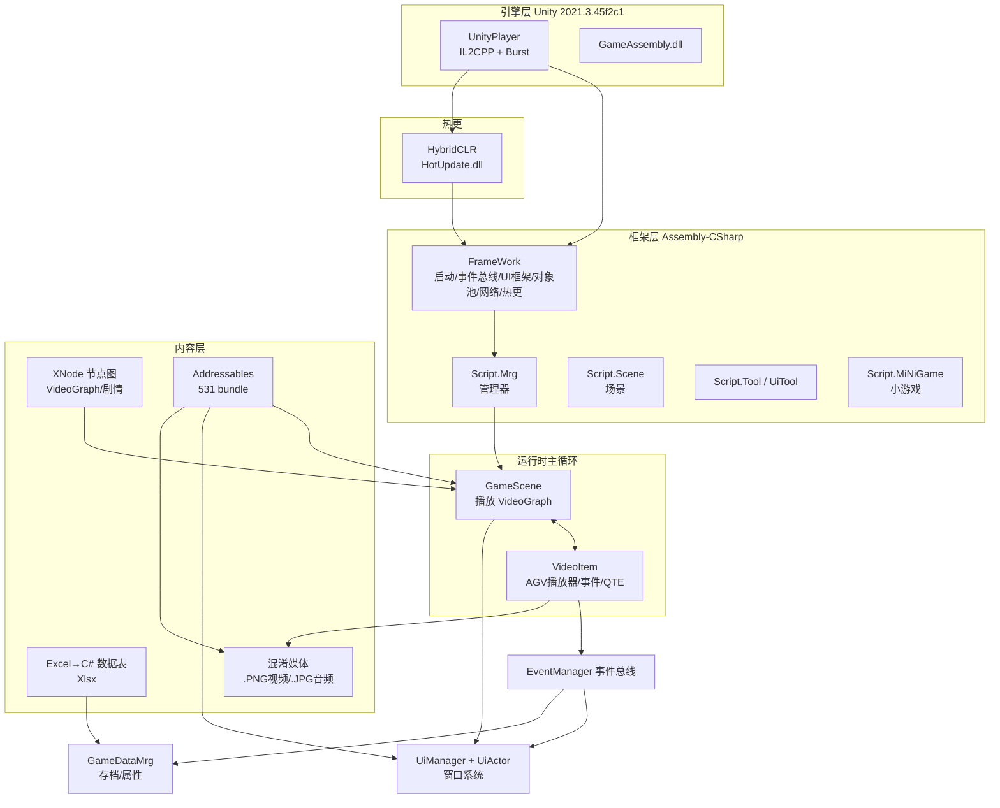

# 00 · 总览与学习地图

## 0.1 一句话定性

这是一款 **Unity 引擎制作的 FMV（Full Motion Video，真人/实拍影像）互动叙事手游**：**"视频是骨架，玩法是挂件，数值是胶水，数据是血脉"**。它用一条条剧情 CG 视频串起主线，在视频的特定时间点"打点"触发各种玩法（选择、QTE、战斗、酒桌、商店、小游戏、365° 视频），配一张庞大的数值网（基础四维 + **18 个女主好感度** + 酒量 + 战斗 + 工作/金钱），用 **Excel 配表 + XNode 节点图** 驱动内容，用 **HybridCLR 热更 + Addressables 分包** 支持上线后持续运营。

## 0.2 项目档案

| 项 | 值 |
|----|----|
| 名称 | 重生2：我独自逆袭（Demo） |
| 厂商/签名 | `app.info` → `ProudmateEntertainment` |
| 引擎 | Unity **2021.3.45f2c1**（中国版） |
| 脚本后端 | **IL2CPP**（AOT）+ **Burst** |
| C# 热更 | **HybridCLR**（运行时加载 `HotUpdate.dll`） |
| 资源系统 | **Addressables**（531 个 bundle / 1.24 GB） |
| 视频播放 | **AVProVideo**（997 个伪装成 `.PNG` 的 MP4，共 28 GB） |
| 内嵌浏览器 | **ZFBrowser / CEF**（H5 小游戏、活动页） |
| 内容编排 | **XNode** 节点图（剧情/VGraph 分支全是拖拽图） |
| 数据 | **Excel → C#**（`Xlsx` 命名空间）+ LitJson + ScriptableObject |
| 存档 | AES(Rijndael 加密) + 断点续玩 + 已看可跳过 |
| 网络 | 自研 Request/RequestTool，指向 `127.0.0.1:8888`（开发态） |
| 逆向可得性 | ⭐⭐⭐⭐⭐ 极高（构建漏删 `_BackUpThisFolder`，源码级） |

## 0.3 三层架构

```
┌──────────── 引擎层 ────────────┐
│ Unity 2021.3(渲染/物理/AI/UI)  │
│  + IL2CPP + Burst + 后处理      │
└──────────────┬───────────────┘
┌──────────── 框架层(Assembly-CSharp) ────────────┐
│ FrameWork(启动/事件总线/UI框架/对象池/网络/热更)    │
│ Script.Mrg(管理器) / Script.Scene / Script.Tool  │
│ Script.UiTool / Script.MiNiGame                 │
└──────────────┬───────────────┘
┌──────────── 内容层 ────────────┐
│ Excel→C# 数据表(Xlsx)/XNode图   │
│ 视频+音频(混淆) / AB(bundle) /  │
│ H5小游戏 / 模型/贴图/UI资产      │
└─────────────────────────────┘
```

## 0.3.5 总体系统架构图



## 0.4 它是怎么做"内容"的（最核心的设计）

大多数玩法是"事后追加到一个视频节点上"，这是它和"传统战斗游戏"最大的不同：

- **内容即图**：每个"剧情事件"= 一个 `VideoGraph`(XNode 图)。
- **节点即镜头**：图里每个 `VideoNode` = 一段 CG 视频。
- **事件即打点**：视频播放到 `evenTime` 就广播事件（开战斗/酒局/商店/存档/切昼夜/发消息）。
- **分支即连线**：`ButtonNode`（选择）、`qteSuc/qteFail`、`enemyDieVideoNode/playDieVideoNode`。
- **数值即副作用**：`PropertyData` 在视频某个秒数加属性/解锁/发奖励。

> 一句话：**它先把"看视频"做成一等公民，再把所有玩法"插"进视频时间轴。** 这是 FMV / 真人互动影视游戏的生产力关键，也非常值得想学互动叙事的人研究。

## 0.5 它的"数值网"长什么样

`PropertyTypeValue`（77 个枚举）是理解游戏设计意图的钥匙：

- **基础四维**：体力 Stamina、智慧 Wisdom、魅力 Charm、道德 Morality
- **养成**：酒量 CapacityForLiquor、执行力 Execution、金钱 Money、压力 Pressure/UpperPressureLimit
- **★ 女主好感度 18 条线**：BZP / WDLY / XFP / XXG / LQT / MM / LBN / ZXSN / DBN / LJ / XJM / NAM / MS / PZ / TSGSN / XXSN / WY / LXY（缩写即女主代号）
- **战斗**：PlayerHp / TmpPlayerHp / EnemyHp / EnemyHpMax / 技能点 + 各武术（组合拳/军体拳/如来神掌/吸血鬼回血/咏春/普攻/近身/反手反击）
- **酒桌**：酒量/醉酒/盆中系列/心动值
- **工作/杂项**：KPI、便利店打工次数、公司知名度/时长、招式熟练度、抓娃王进度、奥数过载……
- 加速/减伤修正：`ZiJiZhengJia`（自己增伤%）、`DiFanZhengJia`（敌方增伤%）

## 0.6 学习地图：这套代码能教会你什么

| 想学 | 看哪 | 关键 |
|------|------|------|
| 事件驱动架构 | `FrameWork/EventManager.cs` | 两级字典 + 对象池消息 |
| UI 框架（非 MonoBehaviour） | `UiActor/Actor/UiManager` | 逻辑对象与 Unity 对象解耦、特性注册、媒体暂停恢复 |
| 数据驱动叙事 | `XNode` + `VideoGraph` + `GameScene` | 图即剧情，事件打点 |
| FMV 视频引擎 | `GameScene/VideoItem` | 多播放器池 + 首帧预解码 + 定格过渡 |
| 数值系统 | `PropertyData` + `GameDataMrg` | 分桶字符串 key + 回合/装备加成 |
| 战斗 | `CombatWindows` + `VideoNode` | 用视频代替打斗动画 |
| 小游戏 | `Script.MiNiGame` | 黄金矿工/反应面板/刮刮乐 |
| 热更+分包 | `HybridCLR` + `Addressables` + `VersionDetection` | 上线后运营三件套 |
| 逆向 | Il2CppDumper + ILSpy + UnityPy | 从二进制到源码 |

---

*下一章：引擎与运行时。*
