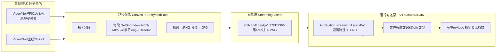

# 02 · 资源管线与媒体还原

## 2.1 资源目录结构

```
StreamingAssets/
├── aa/                                Addressables 主目录
│   ├── catalog.json                   1.15 MB 资源索引(key → bundle/类型)
│   ├── settings.json                  Addressables 设置
│   ├── AddressablesLink/link.xml      IL2CPP 链接保留配置
│   └── StandaloneWindows64/
│       └── <hash>_assets_all_<hash>.bundle   ★ 531 个 bundle(1.24 GB)
├── i55N8rvfL6a/                        ★ 混淆后的外置媒体资源(视频/音频)
│   └── djWu27ED936/<组hash>/<文件hash>.PNG|.JPG
└── MiniGame/Pinball/index.html         内嵌 HTML 弹珠台
```

**bundle 统计**：531 个 / 1,244 MB；最大 `hgvlgfxe0j3_..._bundle` ≈ 93.77 MB，次大 `fsvzemukgv7_...` ≈ 56.09 MB。

## 2.2 混淆算法（Base62-MD5）—— 核心

这是理解整棵媒体树的钥匙。`FrameWork/Tool.cs`：

```csharp
public static string GetShortIdentity0Gc(string key) {
    byte[] b = Encoding.UTF8.GetBytes(key);
    ulong n = (ulong)Math.Abs(BitConverter.ToInt64(_md5.ComputeHash(b), 0)); // MD5 前8字节→long→绝对值
    // 转成 Base62(0-9a-zA-Z)，最长 11 位
}
public static string ConvertToEncryptedPath(string originalPath) {
    // 按 '/' 分段，每段调 GetShortIdentity0Gc
}
public static string GetVideoPath(string videoName) =>
    Application.streamingAssetsPath + "/" + ConvertToEncryptedPath("Video/Nor"+videoName) + ".PNG";
```

**验证结果**（我用整数除法精确复现）：
| 原路径段 | Base62(MD5) |
|----------|-------------|
| `Video` | **i55N8rvfL6a** ✅ 对应根目录 |
| `Nor`   | **djWu27ED936** ✅ 对应第二级 |
| `High`  | 5xuAwMZuBy8（4K 高清版，Demo 未附）|

所以树的真实含义：
```
StreamingAssets/<hash("Video")>/<hash("Nor")>/<hash(组)>/<hash(文件)>.PNG
```
即 `i55N8rvfL6a/djWu27ED936/<组>/<文件>.PNG`。`"Video/Nor"+videoName` 若 `videoName="/<group>/<file>"`，则正好切成 `Video/Nor/group/file` 四段——所以 **视频名本身就含组/文件名**。

**目的**：1) 反爬/反盗链；2) 规避加载白名单（把视频伪装成 PNG、音频伪装成 JPG）；3) 配合 AVProVideo 按字节流读取。



> ⚠️ **改后缀不是加密**——用文件头魔数一识别就破。真要保护得做内容加密 + 自定义加载器。

## 2.3 媒体还原结果（我已做）

对 `i55N8rvfL6a` 下 **1707 个文件**逐个读 **16 字节魔数**：

| 原始后缀 | 检测数量 | 真实类型 | 体积 |
|----------|---------|----------|------|
| `.PNG` | 997 | **MP4(H.264)** | 27.48 GB |
| `.JPG` | 710 | **MP3** | 0.59 GB |
| 真图片 | **0** | — | 0 |

> **没有一张真图片**。`.PNG` 全是视频、`.JPG` 全是音频——后缀纯粹是障眼法。

已还原到 `重生2我独自逆袭Demo_媒体资源\`：
```
视频_Video/<组hash>/*.mp4      (997 个)
音频_Audio/<组hash>/*.mp3      (710 个)
_manifest.csv                   原始混淆路径 → 还原路径 → 类型 → 大小
_README.md
```

## 2.4 图片 / UI / 贴图去哪了（你的疑问）

你看到的空 `图片` 夹是**正常**的——图片不在 `i55N8rvfL6a`，而被打包在：
1. `aa/StandaloneWindows64/*.bundle`（**UI 贴图/图标/预制体/模型/Shader 全在这**）
2. `_Data/sharedassets*.assets`、`resources.assets`、`level*.assets`（Unity 内置序列化资源）

我已用 **UnityPy** 从 531 个 bundle 里解出 **约 8969 张图片**（Texture2D 4529 + Sprite 4440）到
`G:\Projects\Agent\Agent Cli\重生2我独自逆袭Demo_资源解包\图片与UI\`，按 bundle 分目录，每张保留原始资源名（如 `Tips_Atlas.png`、`Background.png`、`Knob.png`）。

> 说明：UI 布局有一半是**代码动态拼的**（`transform.Find("BtnGroup/PuTon/")...` 这类），一半是 prefab 里的 RectTransform 层级。图标/贴图是独立 Sprite 资产。

## 2.5 已知 bug

`视频_Video/.../DOMwZXYga98.mp4`（约 4.5 GB）：**多个 MP4 直接拼接、头部 `ftyp` 的 size 未重写**（写的是 512MB）。多数播放器能播第一个片段，但拖进度/解析时长会异常——构建管线的坑。

---

*下一章：逆向方法论。*
