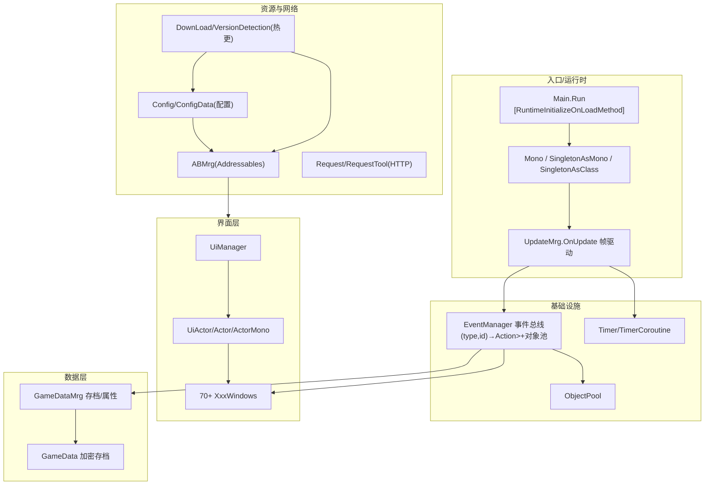

# 04 · 自研框架 FrameWork（最值得学的部分）

`Assembly-CSharp.dll` 的 `FrameWork` 命名空间是一套**小型但五脏俱全的商业手游框架**。读它 = 读一本"国内买量手游框架教科书"。



## 4.1 启动入口
```csharp
// FrameWork/Main.cs —— Unity 启动即执行
[RuntimeInitializeOnLoadMethod]
public static void Run() {
    DOTween.defaultAutoKill = true;
    LoadMrg.LoadAsNotyMapLoad(Scenes.Load);   // 进 Load 场景(资源/热更/版本检测)
}
```

## 4.2 事件总线（EventManager）
```csharp
ConcurrentDictionary<int/*MessageType*/, ConcurrentDictionary<int/*具体事件*/, Action<List<object>>>>
```
- 两级字典：`MessageType`(Game/Ui/Net/Video) → 具体事件枚举 → 委托。
- `Delegate.Combine/Remove` 支持多播。
- **payload 用 `List<object>` 且走对象池**：`GetEventMsg()` 出队、`Dispatch` 后 `EnQueue`，避免 GC。
- 消息分类枚举：
  - `GameMessageType`：SetDisplayMode/SetLanguage/UpdateProperty/ClickTaskItem/UpdateChatRed/ZbUpdate/GetXiaoLian/ChangeVolume/ResetMiniGameItem/ChangeHeartbeat/LoadScene/QteSuc/QteFail/ClickEvent/UpdateMapUnLockPoint
  - `VideoMessageType`（视频时间轴触发）：OpenBox/OpenCombatWindow/CloseCombatWindow/OpenSaveWindows/ClearCoin/OpenRoleInfoWindow/SetDaytime/SetNight/OpenSaveCoveWindows/AutoSaveData/UpdateTime/OpenPhone/ReSetXDL/CheckMsgRi/CheckMsgYe/OpenWineList/TargetAddZuiJiu/PlayerAddZuiJiu/OpenHeJiu/CloseHeJiu/SetRed/SetBack/OpenShop/GetCoin/Bei1000/ShowJieDuan/OpenBaoKeMengUi/CloseBaoKeMengUi/ZhaoZonZhiChang/OpenBgmWin/CloseBgmWin/OpenBqWin/CloseBqWin/OpenEmailWin/CloseEmailWin/OpenCombat2Win/CloseCombat2Win/PlayerAddZuiJiuNotBFB

## 4.3 UI 框架（MVC 变体）—— 见第 08 章

- 每个界面 = `XxxWindows : UiActor : Actor`（**纯 C# 类，非 MonoBehaviour**）。
- 逻辑对象与 Unity 对象解耦：`Actor` 持 GameObject，`ActorMono`(MonoBehaviour) 只做生命周期转发。
- 特性驱动反射注册：`[UiMode(Mode.Background)]` + `[ActorInfo(pack, prefab)]`。
- `UiManager` 维护 `Type↔UiActor` 字典 + `int↔Type` + 返回栈 `_uiList`。
- **打开即暂停视频 / 关闭即恢复**（经 `GameScene.PauseEsc/PlayEsc` + `IsCanPlay()` 聚合判断）——FMV 游戏最妙的细节。

## 4.4 单例三件套
- `SingletonAsMono<T>`：Mono 单例（惰性建 GameObject + DontDestroyOnLoad），`Awake` 默认从 `GameData` 反序列化一个按类名命名的 `Dictionary<string,string>`。
- `SingletonAsClass<T>`：普通 class 惰性单例。
- 静态管理器（LanguageMrg/SdkMrg/LoadMrg/Config/Tool）。

## 4.5 资源封装（ABMrg）
```csharp
ABMrg.Load<T>(name)        // 同步 Addressables.LoadAssetAsync<T>().WaitForCompletion()
ABMrg.LoadAsync<T>(name,cb)// 异步回调
ABMrg.ReleaseAllAssets()   // 释放 handle + Resources.UnloadUnusedAssets + GC
```

## 4.6 对象池 / 定时器
- `ObjectPool<T>` / `ObjectPoolAsComponent` / `ObjectPoolAsGameObject`：泛型对象池（事件消息、AudioSource、UI 条目共用）。
- `UpdateMrg.OnUpdate`(UnityEvent) + `Timer`/`TimerCoroutine`：`IntervalCall/IntervalCallAsTime/DelayCall`，共享 `TimeData` 池。

## 4.7 网络 / 下载 / 热更（详见第 11 章）
- `Request`/`RequestTool`：UnityWebRequest + LitJson，`Send(string/byte[]/Sprite)` 回调 + `SendTaskXxx`（TaskCompletionSource）。都挂在 `SingletonAsMono<Mono>` 上。
- `DownLoad`/`DownLoadAbPack`：增量下载 AB（`ConcurrentQueue<AbPackDate>`，逐包累计进度）。
- `VersionDetection`：对比 streaming 内置清单 / persistent 本地清单 / 远端清单 → 算出需更新的 `AbPackDate` 列表 + 删除已失效旧资源。
- `Config.GetAbPath()` 按平台返回 `/StandaloneWindows64/`、`/Android/`、`/Ios/`、`/WebGl/` + versions + `/`。

## 4.8 全局配置（ScriptableObject）
```csharp
[CreateAssetMenu] public class ConfigData : ScriptableObject {
  versions="1.0.0"; isAb=true; configName="ABConfig.txt"; key="kljsd...";
  dlls=new[]{"HotUpdate.dll"}; downLoadUrl="http://127.0.0.1:3000";
  serverIp="127.0.0.1"; serverPort=8888; ...
}
```
- 被 `Config` 用 `Resources.Load<ConfigData>("ConfigData")` 读取，暴露 `ServerIp/ServerPort/IsAb/Dlls/DownLoadUrl`。

## 4.9 值得学习的设计

1. **逻辑对象(Actor) 与 Unity 对象(MonoBehaviour) 彻底解耦**——生命周期可控、可反射创建、可对象池、可单测。
2. **特性驱动 + 反射自动注册**——一个类加两个特性 = 一个可创建/绑资源/挂层级的界面。
3. **事件总线解耦一切**——数据变更只派发 `UpdateProperty`，UI 自行刷新，模块互不依赖。
4. **属性分桶 + 统一字符串 key**——`property_<type>_<name>` 一个字符串承载整套数值，天然支持回合变体。
5. **表格惰性加载 + 反射填充**——谁第一次查谁才加载，表格作为 TextAsset 走 Addressables（可热更）。

---

*下一章：FMV 互动叙事引擎。*
