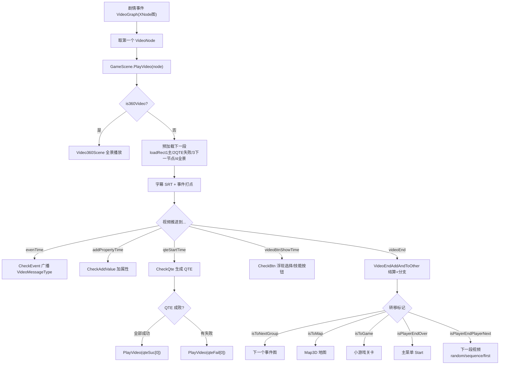

# 05 · FMV 互动叙事引擎（游戏心脏）

这是全游戏最重要的部分。理解了它，就理解了这游戏是怎么"动"起来的。



## 5.1 内容即图（XNode）—— 叙事的生产力关键

- **`VideoGraph : NodeGraph`** = 一个"剧情事件"（对应 `xlsxEventKey`）。
- 图里的节点：`VideoNode`(视频)、`ButtonNode`(选择)、`ChapterNode`(章节)、`MessageNode`(消息)、`AchievementNode`(成就)、`IsHasVideo`/`VideoIf`(条件) 等。
- 节点间用 XNode 的 `[Input]/[Output]` 端口连线 → **策划拖图即写剧情，程序零改动**。

## 5.2 VideoNode：一个视频节点能装多少东西（信息密度最高）

`VideoNode.cs`（199 行字段）是设计意图最集中的类：

| 类别 | 字段 | 作用 |
|------|------|------|
| 视频 | `videoPath/videName`、`subtitleChinese/English` | 放哪段、配什么字幕 |
| 循环 | `isLoopVideo/isToNextVideoToLoopStart` | 待机循环片段 |
| 分支出口 | `nextVideoNode`、`qteFail`、`playDieVideoNode`、`enemyDieVideoNode` | 多结局连线 |
| 按钮 | `isHasBtn`、`videoBtnShowTime/HideTime` | 定时浮现选择按钮 |
| QTE | `isHasQte`、`qteDatas`(List<QteData>) | 内嵌 QTE |
| 战斗 | `isInitHp`、`enemyHp`、`bossName` | 这一段是战斗 |
| 酒桌 | `isHasWineList`、`isInitJiuLian/targetJiuLian` | 这一段开酒局 |
| 360° | `is360Video/maxY/minY/img360` | 全景视频 |
| 副作用 | `PropertyData/setPropertyData/achievement/taskData/chatData/EventValue/VideoEndEventValue` | 加属性/解锁成就/发消息/触发任务 |
| 转场 | `isToMap/isToGame/isToNextGroup/isPlayerEndOver` | 去地图/小游戏/下一事件/结束 |

## 5.3 节点图的条件分支（Tool.GetAllVideoNodes / VideoIf）

中间还夹着条件节点：`VideoIf/ShowIf/IsHasVideo/ColorSurmise/IsWineList/VideoIfPlayerEbriety/VideoIfTargetEbriety/VideoIfAsType`。它们被 `Tool.GetAllVideoNodes` 求值后用 `IsSuc()` 选择成功/失败出口。`VideoIfPlayerEbriety/VideoIfTargetEbriety` = **按"醉酒度"分流**，与酒桌系统联动。

## 5.4 运行时：GameScene.PlayVideo(node) 主循环

```csharp
void PlayVideo(VideoNode node) {
    // 1. 保存进度(断点续玩)
    if (!node.isToNextGroup) {
        GameDataMrg.CurEventKey = ((VideoGraph)node.graph).xlsxEventKey;
        GameDataMrg.CurVideoId  = node.uniqueID;
    }
    // 2. 360° 视频 → 切 Video360Scene
    if (node.is360Video) { Video360Scene.Instance.Init(); return; }
    // 3. 预加载：收集可到达的下一节点(按钮 outVideoNode + nextVideoNode)
    //    → loadRect3 池逐个 VideoItem.Init(预解码首帧)
    // 4. 切换过渡：rawImage.texture = videoItem.CopyRtToTex() 定格上一帧
    //    → videoItem.FadeVideo() 淡出 + 移回父级
    // 5. 字幕：取 subtitleChinese/English → SrtText.ParseSRT()
    // 6. videoItem.Play()
}
```

**`VideoItem.Update()`** 每帧按视频当前时间做几件事（所有 Check 受 `_isCanEx` 总闸控制）：
- `CheckPlay()`：首帧回调 `OnPlayer`（隐藏定格帧）
- `CheckVideoFrame()`：结尾定格帧 + 结算 + 跳转
- `CheckAddValue()`：到 `addPropertyTime` 逐条加属性
- `CheckEvent()`：到 `evenTime` 广播 `VideoMessageType` 事件（开战斗/酒局/商店/存档...）
- `CheckQte()`：到 QTE 时间生成 QTE 控件
- `CheckBtn()`：按钮浮现/进度条/隐藏
- `CheckTutorial()/CheckTask()/CheckAchievement()`

## 5.5 视频结束：VideoEndAddAndToOther(node) —— 结算 + 分支

视频播完做：结算 `VideoEndPropertyData` → 触发 `chatData`（聊天）→ `setPropertyData` → 解锁成就(`SdkMrg.UnLockAchievement`) → 广播 `VideoEndEventValue` → `AddUnLockKey(uniqueID/videoPath)`（记录已看，允许跳过）。

然后按标记分流：
| 标记 | 去向 |
|------|------|
| `isToGame` | 进小游戏关卡 `MinGameLevelSelect` |
| `isToNextGroup` | 下一个 VideoGraph（下个剧情事件）|
| `isToMap` | 3D 地图 `Map3D` |
| `isPlayerEndOver` | 回主菜单 `Start` |
| `isPlayerEndPlayerNext` | 下一段视频（random / sequence / first）|
| `isHasQte` | 全部 QTE 成功→`qteSuc` 出口；否则→`qteFail` 出口 |

## 5.6 玩家控制
- `空格` 暂停/播放（战斗/QTE 中禁）
- `Q` 跳过（**仅当已解锁/看过**）；有按钮则跳到按钮时刻，否则跳近结尾
- 倍速 2x（同样要求已解锁）

## 5.7 彩蛋：OpenBox（密码解锁隐藏视频）
点击某个按钮触发 `InputWindows` 输入框，输入密码（默认 `798`）解锁隐藏视频（`isSucVideo`）——典型"隐藏福利"设计，当玩家输对时播 `isSucVideo` 节点，输错播普通分支。

## 5.8 多播放器池：FMV 无黑屏切换（重点）

`GameScene` 维护 `RectTransform loadRect1/2/3/4` + `Dictionary<VideoNode,VideoItem> _dicMediaPlayer`：
- **loadRect1** 主池（正在播）
- **loadRect2** QTE 失败池（`AddQteLoadVideo`，预加载所有 `qteFail` 出口）
- **loadRect3** 下一节点预加载池（保证分支切换无黑屏）
- **loadRect4** 360° 池（`Add360LoadVideo`）

切换 = 旧帧 `CopyRtToTex()` 冻结到 `rawImage` 做定格过渡 + `FadeVideo()`，新片已解码首帧，实现**无缝换片**。这是 AVProVideo 做互动电影的标准做法。

---

*下一章：战斗与 QTE 系统。*
