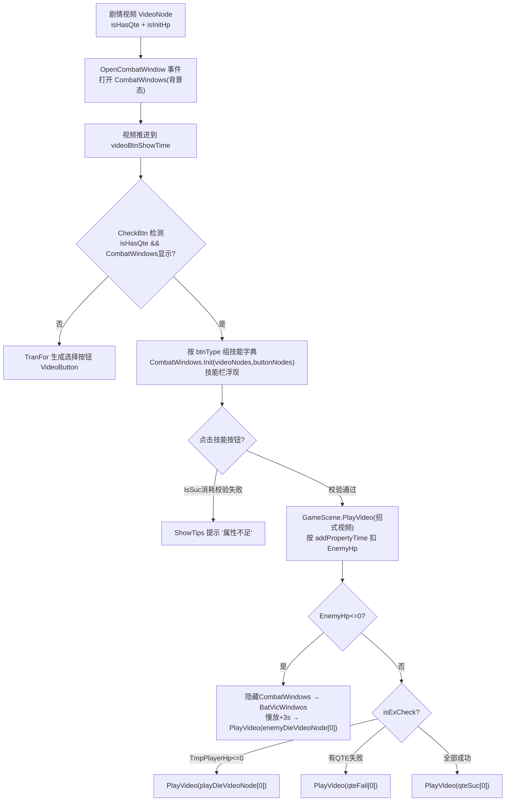

# 06 · 战斗与 QTE 系统



## 6.1 全局架构：数据驱动 / 节点图引擎

剧情由 `VideoGraph`(XNode) 图组成，每个节点是 `VideoNode`。节点通过端口连接表达分支：
- `outVideoNode`（普通叉路）、`nextVideoNode`（顺序/随机/序列）、`qteSuc`/`qteFail`（QTE 成功/失败）、`enemyDieVideoNode`（击败 boss）、`playDieVideoNode`（玩家死亡）、`isToNextGroup/isToMap/isToGame/isPlayerEndOver`（转移标记）。
- 条件节点：`VideoIf/ShowIf/IsHasVideo/ColorSurmise/IsWineList/VideoIfPlayerEbriety/VideoIfTargetEbriety/VideoIfAsType`，在 `Tool.GetAllVideoNodes`(Tool.cs:614-690) 里求值后用 `IsSuc()` 选成功/失败出口。

## 6.2 战斗系统（CombatWindows vs Combat2Windows）

| | `CombatWindows` | `Combat2Windows` |
|---|---|---|
| 角色 | 完整战斗 UI：玩家血条+敌方血条(含 Boss 名)+**7 个技能按钮**+技能点+伤害飘字 | 纯玩家血条 UI：只有一条玩家血条+飘字；无技能按钮、无敌方血条 |
| 打开 | `EventContentMrg.OpenCombatWindow` → `UiManager.OpenUi<CombatWindows>()`；`UiMode.Background` 叠在视频上 | `OpenCombat2Window` 事件 → `UiManager.OpenUi<Combat2Windows>()` |
| 数据源 | 一次性拿到 `(Dictionary<string,VideoNode>, Dictionary<string,ButtonNode>)` 组装技能 | 只监听 `UpdateProperty` 更新血条 |
| 定位 | 玩家可点技能 | **视频驱动、无手动技能**的脚本化战斗（HP 变化由视频节点里的 `PropertyData` 或 QTE 造成，UI 只显示，`UpdateHp` 刷血条+飘字）|

### 技能 / 血条 / 技能点 / 解锁完整流程

**(1) 解锁条件 = 属性 > 0**（CombatWindows.Init, CombatWindows.cs:493-508）：
```csharp
BTZhuHe.SetActive(videoNodes.ContainsKey("ZhuHeQuan") && GameDataMrg.GetProperty("ZhuHeQuan","Property",0) > 0);
// 近身攻击/组合拳/军体拳/如来神掌/吸血鬼回血/咏春 同理; 普攻(PuTon) 只要节点存在就激活
```

**(2) 技能点**：`JiNengDian`(永久) 在视频开始时被拷贝进临时技能点 `TmpJiNengDian`(VideoItem.cs:322)。`InitSkillPoint`(CombatWindows.cs:484-491) 用 `TranFor` 生成技能点图标；每个技能按钮旁的 `XxxPoint` 显示该招消耗的 `TmpJiNengDian` 作为 `<sprite name=ZJD>+N`。

**(3) 点击技能 → 校验消耗 → 播放招式视频**（CombatWindows.cs:405-464）：
```csharp
if (!buttonNode.usePropertyDatas.IsSuc()) {
    UiManager.ShowTips(buttonNode.usePropertyName != 0 ? GetText(usePropertyName) : GetText("A1211"));
} else {
    RectTransformBtnGroup.SetActive(false);      // 收起技能栏
    GameScene.Instance.PlayVideo(videoNode);    // 打出该招式的战斗镜头视频
}
```
`IsSuc()`(Tool.cs:987-1051) 是"最低门槛"判断：要求当前属性 **> 严格大于** 配置值（`>=` 视为不满足）。

**(4) 血条刷新**：`UpdateHp`(CombatWindows.cs:598-620)：`PlayerHp`/`TmpPlayerHp`、`EnemyHp`/`EnemyHpMax`。注册在 `OnEnable`，由 `GameMessageType.UpdateProperty` 反复触发。伤害飘字：当 `objects[2]`(变化量) `<0` 且 `objects[1]=="EnemyHp"` 时塞入 `_enemyLoseData`；`TmpPlayerHp` 时塞入 `_playerLoseData`。

**(5) 伤害加成（增伤/减伤）** — `AddTypeValueAsShowTips`(Tool.cs:1247-1278)：
```csharp
if (propertyTypeValue == TmpPlayerHp)  value = (int)(orig * Mathf.Max(0, 1f + GetProperty("DiFanZhengJia")/100f));
if (propertyTypeValue == EnemyHp)      value = (int)(orig * Mathf.Max(0, 1f + GetProperty("ZiJiZhengJia")/100f));
```
即 `ZiJiZhengJia`(自己增伤%) / `DiFanZhengJia`(敌方增伤%) 缩放伤害，战斗开始时二者被重置为 0。

### 战斗如何与剧情视频交织（核心）

战斗不是独立场景，而是 **Opaque 地叠在播放的视频上**：
1. 某剧情 `VideoNode` 标记 `isHasQte=true` + `isInitHp=true`（初始化 `EnemyHp/EnemyHpMax`）。
2. `EventContentMrg.OpenCombatWindow` 打开 `CombatWindows`（背景态）。
3. 视频推进到 `videoBtnShowTime` 时 `CheckBtn`(VideoItem.cs:414-459) 检测 `isHasQte && UiManager.IsShowUi<CombatWindows>()` → 组技能字典 `CombatWindows.Init(dict,dict2)` → **技能栏浮现**。
4. 点技能 → `GameScene.PlayVideo(videoNode)` 播放该招**攻击镜头视频**，其 `PropertyData`(多为 `EnemyHp` 负值) 按 `addPropertyTime` 扣敌人血。
5. 部分战斗由 QTE 驱动。
6. `EnemyHp<=0` → 隐藏 `CombatWindows` → 开 `BatVicWindwos`(胜利窗, 3.5s 自动关, 播 combatSuc) → `SetPlaybackRate(0.4f)` 慢放 + 声音淡出 → 3s 后 `PlayVideo(enemyDieVideoNode[0])` 播敌人死亡镜头。
7. `isExCheck` 时：`TmpPlayerHp<=0` → 播 `playDieVideoNode[0]`；否则若 `_failCount>0` → 播 `qteFail[0]`。

所以战斗 = **技能点击播放"招式视频" + QTE 造成数值 + 覆盖式 HP/技能点 UI + 结算(胜利/失败)分叉**，与线性 FMV 无缝交织。

## 6.3 QTE 系统

### QteType 六种
```
NoneGo, CondensationGo, KeyGo, SlideGo, ClickGo, NoneFailGo
```
`QteData`(QteData.cs)：`qteStartTime/qteEndTime/clickCount/qteLoc/qteName`，成败两套 `PropertyData(sucPropertyData/losePropertyData)`、`isExAdd`、`isExCheck`、`isSucEx`。

### QteBtn 判定（QteBtn.cs）
`Init`(QteBtn.cs:43-109)：`_showTime = end - start`。成败回调 Combine 叠加默认行为：成功实例化 `<Type>Suc` + 播 `qteSuc`(NoneGo/NoneFailGo 除外) + 销毁自身；失败实例化 `<Type>Fail` + 播 `qteFail` + 销毁。

`Update`(QteBtn.cs:111-137) 按类型分发：

| 类型 | 交互 | 判定 |
|---|---|---|
| `NoneGo` | 无输入 | 时间窗走完 → 自动成功 |
| `NoneFailGo` | 无输入 | 时间窗走完 → 自动失败 |
| `CondensationGo` 聚气 | 环形计数条 `ag.fillAmount` 收拢 | 时间到→失败；正确时机点击→成功 |
| `KeyGo` 按键 | `ag` 收拢 | 按中随机方向键→成功；WASD 等价也算；超时→失败 |
| `SlideGo` 滑动 | 指示器从左滑到右 | 鼠标/触摸/空格时 `ag.x` 落在 target 矩形内→成功，否则失败 |
| `ClickGo` 连点 | 文字 `次数/目标` + `ag` 收拢 | 每按一次 `_clickCount++`；到 `clickCount`→成功；超时→失败 |

时间窗 = `[qteStartTime, qteEndTime]`。

### 生成 + 成败分流（VideoItem.CheckQte, VideoItem.cs:610-806）
```csharp
// 到 qteStartTime 且未生成
Instantiate(ABMrg.Load<GameObject>(item.qteType.ToString()), qteGroup);   // 635
obj.GetComponent<QteBtn>().Init(item, suc, lose);                         // 627
```
**成功回调**：`AddProperty("QteSucCount",+1)`、`SetProperty("QteFailCount",0)`、派发 `QteSuc`；按 `isExAdd` 即时加属性；`isSucEx=true`；若 `EnemyHp<=0` 播 `enemyDieVideoNode[0]`；预加载 `qteFail` 视频；`isExCheck` 时处理玩家死亡/失败分支（VideoItem.cs:662-688/700-715）。

**失败回调**：`_failCount++`、`QteFailCount++`、派发 `QteFail`、即时生效 `losePropertyData`（逻辑镜像）。

**最终分叉**（GameScene.cs:496-513）：当 `isHasQte` 且**所有 QteData 都 `isSucEx`** → `PlayVideo(GetAllVideoNodesOutQueSuc()[0])`；否则 → `GetAllVideoNodesOutQueLose()[0]`。这就是节点图里 `qteSuc`/`qteFail` 出口的剧情分流。

## 6.4 VideoItem 完整机制（Script.Tool/VideoItem.cs, 873 行）

### 初始化与"首帧定格"
- `Awake`(73-79)：canvasGroup.alpha=0、音量为 0、隐藏进度条与 rawImage。
- `Init(videoNode,parent,lastNode)`(91-125)：监听 `videoPlayer.Events`：
  - `FinishedPlaying` → `VideoEnd(_videoNode)`；
  - `FirstFrameReady` → 设 Loop + `SetPlaybackRate(1)`，若 `_isCanPause` 则 `Pause("视频首帧开始暂停")`——**视频只解码出第一帧就暂停，等待主控真正 `Play()`**。
- `Init(playCall)`(127-154)：`_playCall=playCall`、`InitValue()`、设音量、`canvasGroup.alpha=1`、`Play()`。

### Update 主循环(197-214)
```csharp
if (_videoNode != null && _isCanEx) {
    CheckPlay(); CheckVideoFrame(); CheckAddValue();
    CheckEvent(); CheckQte(); CheckBtn();
    CheckTutorial(); CheckTask(); CheckAchievement();
}
```
所有 Check 受 `_isCanEx`(关)= false 整帧跳过，是"可暂停/可切换"的总闸。

### 逐个 Check
- **CheckVideoFrame(定格过渡)**(482-499)：非循环且正在播放，`curTime >= videoTime-0.1(_checkTime)` 且未 `isPlayEndFrame` → 置标记 + `AddPropertyData()`；若非转场标记 → `VideoPlayerEndToNext(_videoNode)`。
- **CheckAddValue**(828-858)：遍历 `_videoNode.PropertyData`，到 `addPropertyTime` 且 `!isEx` 时 `AddTypeValueAsShowTips()`。跳过规则：`!isRound && !isAlwaysEx && IsUnLockKey(uniqueID)`（已看过且非循环则不再加）。
- **CheckEvent**(808-826)：`!EventValue[i].isEx && curTime >= evenTime` → `DispatchEvent(MessageType.Video, eventName, eventMsg.Add(eventValue))`。
- **CheckQte**：见 §6.3。
- **CheckBtn**(414-459)：到 `videoBtnShowTime` 浮现按钮 + 进度条；若 QTE 战斗 → 组技能字典给 `CombatWindows.Init`；否则 `TranFor` 逐个 `VideoButton.Init`；到 `videoBtnHideTime` 且非 loop → `RemoveBtn()`。
- **CheckTutorial/CheckTask/CheckAchievement**：分别到 `tutorialCheckTime`/`taskData.exTime`/`achievement.exTime` 一次性触发。

### 多播放器池 + 首帧解码预加载（见第 05 章 5.8）
`GameScene` 维护 `loadRect1/2/3/4` 四组后台 MediaPlayer 预解码。切换时旧帧 `CopyRtToTex()` 冻结到 `rawImage` + `FadeVideo()`，实现 FMV 无黑屏分支。

---

## 关键代码片段索引
| 文件 | 行号 | 内容 |
|---|---|---|
| CombatWindows.cs | 493-508 | 技能解锁 = 节点存在 && 属性>0 |
| CombatWindows.cs | 461-463 | 点技能 → 收起技能栏 + PlayVideo(招式视频) |
| Tool.cs | 1247-1278 | 伤害百分比修正(敌我增伤) |
| Tool.cs | 987-1051 / 1053+ | IsSuc / IsSucOr 门槛校验 |
| VideoItem.cs | 624-626 | QTE 生成 `Instantiate(qteType.ToString())` |
| VideoItem.cs | 662-688 | 成功回调 + EnemyHp<=0 胜利结算 |
| VideoItem.cs | 700-715 | isExCheck → 玩家死亡/失败分支 |
| GameScene.cs | 496-513 | 全 QTE 成功→QueSuc[0]，否则→QueLose[0] |
| VideoItem.cs | 197-214 | Update 主循环 |
| VideoItem.cs | 414-459 / 482-499 / 808-826 | CheckBtn / CheckVideoFrame / CheckEvent |

---

*下一章：小游戏矩阵。*
