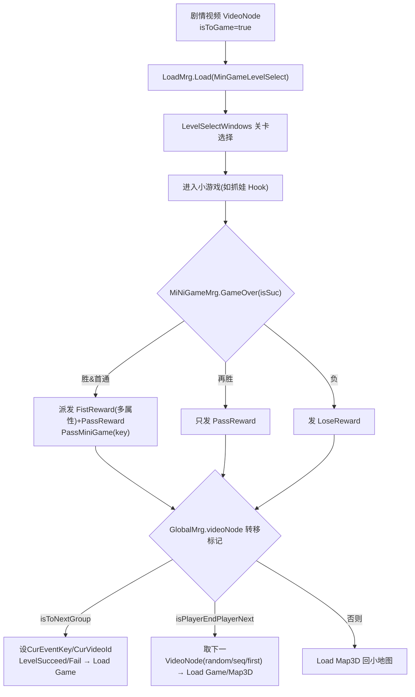

# 07 · 小游戏矩阵

游戏内置了 **5+ 种小游戏**，全部"挂"在剧情视频节点上，玩完把结果（奖励/成败）回传给剧情。



## 7.1 数据结构

- **关卡** `Xlsx_MiNiGameLevel`：`Key(A1..A9)`、`Target`(目标分, -1=清空/无固定目标)、`Time`、`Level`(JSON 文本，内容 `List<MiNiGameLevelData>{prefabName,x,y}`)、`IsHasBqb`、`PassReward/FistReward/LoseReward`、`Icon/Title`。
- **道具** `Xlsx_MiNiGameItem`：`Key`、`Price`、`Add`(加成系数)、`MaxGet`(-1 无限)、`TouchDesc`。
- `ItemType`：`Nor / BiaoQinBao / ZhaDan / CaiDanBao / DianZan`。
- `Item`：`itemType/scoreValue/weight/exRange`。

`MiNiGameMrg` 是中央管理器（Start 加载关卡、并行计时、结算回传剧情）。`MiniGameLevelSelectScene.Start` → `OpenUi<LevelSelectWindows>`；`VideoItem.VideoEnd` 中 `isToGame` → `LoadMrg.Load(MinGameLevelSelect)` 且 `GlobalMrg.videoNode = node`——**视频节点是小游戏入口**。

## 7.2 逐个玩法

### ① 抓娃机 / 抓手（黄金矿工）——主玩法
`Hook.State`(Rotate/Shoot/Retract)。
- Rotate：摆臂 ±70°(rotateSpeed)；点鼠标 → Shoot：`firePoint` 沿局部 up 以 shootSpeed 上移，超 maxDistance→收。
- Retract：`MoveTowards` 回原点，被抓物跟随 `target`，速度 = `shootSpeed/item.weight`（越重越慢）。
- `LineColl.OnTriggerEnter2D`：`hook.currentState==Shoot` 且碰到 Item → `hook.StartRetract(component)`。
- 收口结算(`CompleteRetract`)：
  - `BiaoQinBao`(表情包/娃娃)→ `LowerShiWa()`(降低遮挡 + 生成新) + 派发 `GetXiaoLian`；
  - `CaiDanBao`(彩蛋包)→ 随机奖 `Stamina/Wisdom/Charm/Money`(Hook.cs:216-223)；
  - 任意抓取 → `AddScore(item)`。
  - 炸弹：抓 `ZhaDan` 且拥有 `DaLiYaoShui(大力药水)` 则跳过；否则命中触发 `tntFx` + `ClearRandomItem` 清掉周围物品；收途中按空格且持有 `ZhaDan` → `zhaDanFx` 引爆 + `AddProperty("ZhaDan",-1)`。
- `AddScore`(MiNiGameMrg.cs:310-339)：`score += item.scoreValue * (1 + ErWaiJianLi*Add)`，显示加减飘字/音效；达标即 `GameOver()`。

### ② 抓娃娃视频（SiWaMrg）
A6/A7/A9 或其它档位用 `VideoPlayer` 循环放"笑脸/娃娃"片段；`GetXiaoLian` 事件每次 fade 0.2s 切下一段(index++)并播 `bqbClip`。纯视觉反馈（连击爽感）。

### ③ 掉落物（DiaoLuo）
向下匀速坠(speed=10)，`showTime=5s` 后销毁。

### ④ 小偷（XiaoTou）
左右巡逻，`moveTime=2s` 翻转朝向 + `localScale.x` 翻转。

### ⑤ 随机小偷（XiaoTouRandom）
在 `points[]` 里随机挑目标匀速走，到位后随机换点；按目标在左/右翻转朝向。

### ⑥ 甩卖（ShuaiMai）
每 1s 在 `minPos.x..maxPos.x`、y=6 处 `Instantiate("SetItem")` 随机 sprite（下落的收集物）。

### ⑦ 小黑痣（XiaoHeiZhi）
持续找最近 `ItemType.DianZan`(点赞) → 移动靠近，碰到生成 `DianZanAnim` 并销毁该点赞物（点"赞"收集玩法）。

### ⑧ 移动小游戏物品（MoveMiniGameItem）
左右随机巡逻，`moveTime` 随机 0.5~2s，超时或越界翻转。

### ⑨ KPI 显示（KpiInfo）
把 `KPI` 属性格式化显示 + "反弹时间"= 下个阈值(`times=[8,23,33]`) − `CurRound`。

### ⑩ 关卡选择（LevelSelectItem）
解锁 = 通过上一关（A1 直接可取；A5 需 `CurRound>=17`）。已通过显示图标/标题/奖励，未通过显示"？？？？+遮罩"。`Click` → 设 `xlsxMiNiGameLevelKey` → 开 `LevelItemSelectWindows`；`Skip` → 直接 `GameOver()`。

### ⑪ 属性升级（MiniGameShuXin）
买"永久属性"：花 `Price` 体力，`AddProperty(Key,+1)`、`AddProperty(Key+"_Get",+1)`；显示 `(+Add×属性×100%)` 与红星个数，受 `MaxGet` 限制。这类"养成词条"在 Hook/时间内按 `GetProperty(Key,"Nor")*Add` 放大（如 DaXiao 时间加成）。

### ⑫ 道具（MiniGameDaoJu）
买"消耗品"：`Key+"_Get"` 记录已购，`MaxGet` 限购；显示剩余；成本体力；`AddProperty(Key)` 即持有数。

## 7.3 道具 → 属性加成汇总

| 道具 Key | 作用 | 实现 |
|---|---|---|
| `DaXiao`(大小) | 关卡时间 `Time*(1+DaXiao*Add)`；抓手 `daXiao=norDaXiao*(1+_daXiaoAdd)` | MiNiGameMrg.cs:90-92; Hook.cs:116-118,158 |
| `ShuDu`(速度) | 抓手发射/收速 `shootSpeed=norSpeed*(1+_speedAdd)` | Hook.cs:113-114,159 |
| `ErWaiJianLi`(额外建立力) | 分数倍率 `1+ErWaiJianLi*Add` | MiNiGameMrg.cs:314-319 |
| `FuZhuCao`(辅助槽) | 开辅助线 `fuZhuXian/fuZhuCao` | Hook.cs:115,123 |
| `ZhaDan`(炸弹) | 开炸弹+引爆 | Hook.cs:120,157,238-253 |
| `DaLiYaoShui`(大力药水) | 抓 ZhaDan 免疫 + 开 `daliGo` | Hook.cs:121,270 |

## 7.4 奖励如何回传剧情（VideoNode 分流）

`MiNiGameMrg.GameOver(isSuc)`(MiNiGameMrg.cs:125-256)：
- 胜 & 首通 → 逐条发 `FistReward/FistRewardCount`(多属性) + `PassMiniGame(key)` + 发 `PassReward`；再胜只发 `PassReward`；负 → 发 `LoseReward`。
- 然后取 `GlobalMrg.videoNode` 分流：
  - `isToNextGroup` → 设 `CurEventKey/CurVideoId` → `LevelSucceed/FailWindow` → Load `Game`；
  - `isPlayerEndPlayerNext` → 按 random/sequence/first 取下一个 `VideoNode`；若**下一个** `isToMap` → Load `Map3D`，否则 Load `Game`；
  - 否则（普通剧情后接小游戏）→ Load `Map3D`(回小地图)。
- `LevelSelectItem.GameOver`(LevelSelectItem.cs:93-156) 用**同一套分支逻辑**。**奖励写入 `GameDataMrg`，后续剧情走向由发起节点的转移标记决定**。

## 7.5 宝可梦 / 彩票 / 商店

### BaoKeMengWindows（"宝可梦"式战斗血条覆盖层）
两栏血条(`SelfHp/TargetHp` 用 `Image.fillAmount`)。`InitHp` 用 `TmpPlayerHp/PlayerHp` 与 `EnemyHp/EnemyHpMax`；`UpdateHp` 用 DOTween(`DOFillAmount(...,0.2f)`) 平滑掉血，监听 `UpdateProperty`。由事件 `OpenBaoKeMenUi/CloseBaoKeMenUi` 开/关，播 `baoKeMenZhanDou` 循环音。复用战斗血量字段。

### CaiPiaoWindows（刮刮乐）
- 初始化：把底层图复制成 `eraseTexture`，`ImageMask.material=Shader("UI/Unlit/Transparent")`，`Sprite.Create` 作蒙版。
- 刮除：鼠标按住时把屏幕坐标换算到 `eraseTexture` UV，在 `brushSize=30` 圆范围内 `SetPixel(Color.clear)` + `Apply()`。
- 判定：每 30 帧 `CheckEraseRatio`——统计 `alpha<0.1` 像素占比，`>=completeRatio(0.3)` → 完成 → `EraseAll()`。
- 奖池：`RandomReward` 加权 4 档 `[10000→0, 5000→10, 3000→50, 100→1000000]`。刮完关按钮点亮；`coin==0` → 提示"未中奖"；否则发 `Money` 属性。

### ShopWindows（商店列表）
`Init(type)`：按 `GetType==t` 过滤 → 过滤限购(`GetMaxCount==-1` 或 `GetCount<max`)→ `Sort(-Range)` 降序 → `TranFor` 生成 `ShopItem`。

### ShopGetWindows（购买确认）
`OnClickGet`(ShopGetWindows.cs:307-335)：
```csharp
if (_count + GetCount > MaxGet) tip("A1328");
else if (GetProperty("Money","Property") >= _count*Price) {
    AddProperty("Money", -_count*Price, "Property");
    AddProperty(_xlsxItem.Key, _count, "GetCount");
    if (Enum.TryParse<ItemType>(_xlsxItem.Key, out var result))   // Key 能解析为 ItemType 则发物品
        new PropertyData{ PropertyType=Item, itemType=result, PropertyValue=_count }.AddTypeValueAsShowTips(false);
    CloseUi(); UiManager.GetUi<ShopWindows>().Init();
} else tip("A1230");
```
即 **金币抵扣 → 写入 `Money/GetCount` → 若 key 恰是物品枚举则发物品**。

## 7.6 内嵌 H5 小游戏（MinigameWebViewLauncher）

用 `ZenFulcrum.EmbeddedBrowser.Browser` 跑 HTML5 小游戏（默认 `Pinball`）：
- `OpenGame(folder)`：读 `streamingAssets/MiniGame/<folder>/index.html` → `browser.LoadHTML(html)`（**内嵌而非 URL**）；`onLoad` 后把黑色遮罩 fade 掉。
- `EnsureEventSystem`：无 `EventSystem` 时补建 `EventSystem+StandaloneInputModule`（浏览器输入需要）。
- JS↔C# 互调：每帧 `browser.CallFunction("setGameMoney", Money)` 把金币推给 JS；`RegisterFunctionAll` 让 JS 回调 `OnMoneyChanged`(加/减 Money)、`OnGameEnded`。即 **H5 弹珠台在引擎里跑，金币状态双向同步**。

---

## 关键代码片段索引
| 文件 | 行号 | 内容 |
|---|---|---|
| MiNiGameMrg.cs | 125-256 | GameOver(首通/Pass/Lose 奖励 + 三分支) |
| LevelSelectItem.cs | 93-156 | GameOver(同分支) |
| Hook.cs | 268-297 | StartRetract(weight 减速 / ZhaDan 炸弹 / DaLiYaoShui 免疫) |
| Hook.cs | 204-234 | CompleteRetract(BiaoQinBao/CaiDanBao/AddScore) |
| CaiPiaoWindows.cs | 130-154 / 173-200 / 202-220 | 加权奖池 / 圆形刮除 / 30% 完成判定 |
| ShopGetWindows.cs | 307-335 | 商店购买(金币扣款 + GetCount + 物品发放) |
| MinigameWebViewLauncher.cs | 96-116 | H5 双向同步 |

---

*下一章：UI 窗口系统。*
