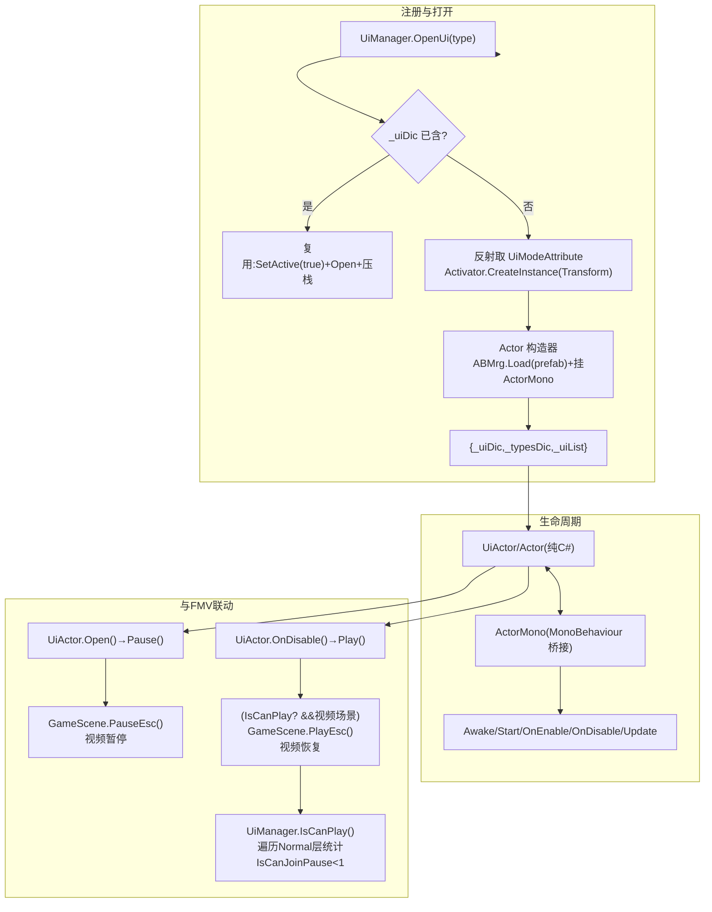

# 08 · UI 窗口系统

> 这是一套 **「面向 Actor（非 MonoBehaviour）+ 特性驱动反射注册 + 事件总线解耦 + Addressables 加载 + DOTween 动画」** 的纯 C# UI 对象框架。所有界面继承 `UiActor`，生命周期由框架统一接管，与 FMV 视频的"打开即暂停/关闭即恢复"联动是核心。



## 8.1 架构总览

```
UiActor (界面逻辑，纯C#类)
   └─ Actor (基类，非MonoBehaviour，持有GameObject)
         └─ ActorMono (MonoBehaviour桥接器，转发Unity生命周期到Actor)
   └─ UiManager (静态门面：注册/打开/关闭/层级/返回栈/Tips)
   └─ UiRoot (Canvas根，模式层容器)
   └─ Mode (层级枚举) / UiModeAttribute / ActorInfoAttribute
   └─ EventManager (事件总线) / ABMrg (Addressables) / ObjectPool<T>
```

**要点：这套框架严格把「游戏对象」与「逻辑对象」分离。** 界面类本身不是 MonoBehaviour，只是普通 C# 类；真正挂在场景里的 `ActorMono` 只把 Unity 的 `Awake/Start/Update/OnDestroy` 等回调转发给 `Actor`。这极大降低了 UI 逻辑对 Unity 生命周期的耦合，也方便反射式创建与对象池复用。

## 8.2 UiManager 的注册与打开/关闭

静态类 `UiManager` 持有：
- `_uiDic : Dictionary<Type, UiActor>`（类型→实例，已创建的界面）
- `_typesDic : Dictionary<int, Type>`（自增索引→类型）
- `_uiList : List<int>`（返回栈，供 `Back()`）
- `_index`（全局自增唯一索引）
- `_layerDic : Dictionary<string, Transform>`（按 Mode 缓存层级挂载点）

**打开流程**（`OpenUi(Type, object[])`，UiManager.cs:180-228）：
1. 若 `_uiDic` 已含该类型 → 复用：`SetActive(true)`、调 `Open(objects)`、`SetAsLastSibling()` 置顶、索引压入 `_uiList`。**已是实例的界面不销毁重建，只是重新激活。**
2. 否则 → 反射取 `UiModeAttribute`（没有报错"类不具备UiModeAttribute"），得到层级；再 `Activator.CreateInstance(type, new[]{ transform })` 用构造器 `(Transform)` 创建（此时 `Actor(Transform)` 会加载 prefab 并挂 `ActorMono`）；随后 `Open(objects)`、`SetIndex(_index)`、写入三个字典、`_index++`。

**隐藏流程**（`HideUi(Type)`，UiManager.cs:253-265）：调 `OnClose()` → `SetActive(false)` → 从 `_uiList` 移除。**不删除**于 `_uiDic/_typesDic`，即对象保留，下次 `OpenUi` 直接复用。

**真正删除**（`RemoveUi(Type)`，UiManager.cs:288-299）：`OnClose()` → 从三个字典移除 → `Destroy()`。

**返回栈**（`Back()`）：取 `_uiList` 最后一个索引发 `HideUi`，实现逐层返回。

**隐藏全部/批量**：`HideAllUi(type)` 通过事件总线派发 `UiMessage/Remove` 事件（带 `-1` 代表全部）。`UiActor` 监听，索引匹配或 `==-1` 时执行（UiActor.cs:106-133）。

## 8.3 Actor / UiActor 生命周期与 ActorMono 桥接

- **`Actor`**（纯 C#）持有 `_gameObject`，读取 `ActorInfoAttribute`，`ABMrg.Load<GameObject>(PrefabName)` + `Instantiate` + `AddComponent<ActorMono>().SetActor(this)`（Actor.cs:16-49）。暴露完整虚拟生命周期（Awake/Start/OnEnable/OnDisable/Update/...），由 `ActorMono` 转发。提供 `AddListener/RemoveListener/DispatchEvent` 封装 `EventManager`。`IsCanJoinPause()` 默认 true。
- **`ActorMono`**（很薄）：把 Unity 事件桥接到 Actor。
- **`UiActor`** 补充 UI 行为：
  - `Open(objects)`：播放打开动画（Bg 淡入、View 0.6→1 缩放+淡入），派发 `UiMessage/Open`，然后 `Pause()`。
  - `CloseUi()`：播放关闭动画，完成回调 `UiManager.RemoveUi(GetIndex())`。
  - `Start()` 里注册 `ShowUi/HideUi/RemoveUi` 事件监听（UiActor.cs:77-83）。

## 8.4 特性（UiModeAttribute / ActorInfoAttribute）

- **`UiModeAttribute`**（AllowMultiple=true）：`Mode Mode`（Background/Normal/Popup/Control/Main/Load/MainItem）+ `bool isCanRemove`。运行时被 `UiManager.OpenUi`/`GetTransform` 读取决定层级挂载点。
- **`ActorInfoAttribute`**（AllowMultiple=false）：`PackName` + `PrefabName`（Addressables 资源包名/预制体名）。被 `Actor`/`UiActor` 构造器用来加载实体。

> 二者实现"**一个类 + 两个特性 = 一个可被反射创建、绑定资源、挂到正确层级的界面**"。

## 8.5 单例机制

- `SingletonAsMono<T>`（SingletonAsMono.cs）：`Instance` 先 `FindObjectOfType<T>`，没有则 `new GameObject(typeof(T).Name).AddComponent<T>()` + `DontDestroyOnLoad`。`Awake()` 用 `JsonMapper` 从 `GameData.GetValue(GetDataKey())` 反序列化 `Dictionary<string,string>` 持久化数据。
- `SingletonAsClass<T>`：普通 class 惰性单例。
- `Mono`：`SingletonAsMono<Mono>`，提供 `Frame(Action)`（下一帧，协程）与 `Wait(time, action)`。

## 8.6 UI 与游戏视频的 暂停/恢复 联动（本框架最核心设计）

1. **打开界面 → 暂停视频**：`UiActor.Open()` → `Pause()`（UiActor.cs:57-63）：
   ```csharp
   protected virtual void Pause() {
       if (GlobalMrg.videoState == VideoState.GameScene && (bool)GameScene.Instance)
           GameScene.Instance.PauseEsc();     // 暂停视频
   }
   ```
2. **关闭界面 → 恢复视频**：`UiActor.OnDisable()` → `Play()`（UiActor.cs:185-189）：
   ```csharp
   public override void OnDisable() { base.OnDisable(); Play(); }
   protected virtual void Play() {
       SingletonAsMono<Mono>.Instance.Frame(delegate {
           if (UiManager.IsCanPlay() && GlobalMrg.videoState == VideoState.GameScene && (bool)GameScene.Instance)
               GameScene.Instance.PlayEsc();   // 恢复视频
           EventManager.DispatchEvent(MessageType.UiMessage, UiMessageType.Close);
       });
   }
   ```
3. **聚合判断 `IsCanPlay()`**（UiManager.cs:383-396）：遍历 `Mode.Normal` 层所有激活界面，统计 `IsCanJoinPause()==true` 的个数，**若 `< 1` 才允许恢复视频**。`MainWindows` 在 `videoState==Map` 时覆盖返回 `false`。
4. **粘住不暂停/不恢复**的特殊界面：`BgmWindows`/`BaoKeMengWindows`/`BqWindows` 重写了 `Pause()/Play()` 为空，不参与联动（它们自身是覆盖层）。

> 联动链路：开 `UiActor → Pause() → GameScene.PauseEsc() → 视频暂停`；关 `UiActor → OnDisable → Play() → (IsCanPlay? 且视频场景) → GameScene.PlayEsc() → 视频恢复`。多界面靠 `IsCanJoinPause` 聚合避免误恢复。

## 8.7 界面目录（逐个梳理）

| 界面 | Mode | 功能 | 数据/管理器 |
|---|---|---|---|
| **MainWindows** | Normal | 主界面枢纽：地图/装备/角色/消息/存档/设置/任务/昼夜切换按钮；按 `VideoState` 动态调整布局；任务角标、昼夜切换 | GameDataMrg、LoadMrg、Xlsx_RoundInfo/Task |
| **MapWindows** | Normal | 3D 地图的 2D 小地图悬浮层：`WorldToViewportPoint` 投影点位；点击确认后传送(普通点扣25金币)；昼夜分 RiMap/YeMap | Map3DScene、GameDataMrg、Xlsx_Event/Item |
| **MapRiWindows / MapYeWindows** | Normal | 白天/黑夜两套地图界面 | GameDataMrg(IsMorning) |
| **RoleWindows** | Normal | 装备/属性界面：部位+背包网格；Toggle 过滤；监听 `ZbUpdate` 刷新 | Xlsx_Item_Query、GameDataMrg |
| **SettingWindows** | Normal | 设置（抽帧版几乎空） | — |
| **ShopWindows** | Normal | 商店列表：按 type 过滤、Limit 限购、Range 排序 | Xlsx_Item、GameDataMrg |
| **ShopGetWindows** | Normal | 购买/获取结果弹窗 | GameDataMrg、PropertyData |
| **EmailWindows** | Normal | 邮件/信件聊天：`InitChat` 逐条延迟打字+选项分支；右上显示好感度 | Xlsx_Message/ChatGraph、GameDataMrg |
| **PhoneWindows** | Normal | 手机聊天：消息列表按"红点+最新时间"排序；逐条打字、选项分支 | GameDataMrg.GetChat、AudioMrg |
| **WineListWindows** | Normal | 酒/道具列表 | — |
| **HeartbeatWindows** | Normal | 心跳视频小窗（VideoPlayer + HeartbeatTool）切换视频 | VideoPlayer、EventManager |
| **LoadSaveWindows** | Normal(isCanRemove=false) | 存档/读档界面：默认生成空档、自动档+手动档列表、NewSave 弹命名窗 | GameDataMrg、SavedData |
| **SaveWindows** | Normal(isCanRemove=false) | 与 LoadSaveWindows 同构（含教程 SaveIcon） | 同上 |
| **TaskWindows** | Normal | 任务面板：未完成/已完成/已过期页签；`TaskItem`+`TaskInfo` 详情 | Xlsx_Task、GameDataMrg |
| **RecordWindows** | Normal | 档案/回放中心：[主线]→VideoListWindows、[新动故事]→HeartbeatWindows、[其他故事] | FolderDataGroup |
| **InputWindows** | Normal | 文本输入窗（12 字上限）；用于命名新档、密码开箱 | TMP_InputField、Action<string> |
| **EscWindows** | Normal(isCanRemove=false) | 暂停/ESC 菜单：继续/手机/存档/角色/任务/教程/设置/调试 | MainWindows、LoadSaveWindows、TutorialWindows |
| **TutorialWindows** | Normal | 教程幻灯片（多张 Sprite 翻页）；点背景确认关闭 | Sprite[]、SureWindows |
| **LevelSelectWindows** | Normal | 小游戏关卡选择网格 | Xlsx_MiNiGameLevel、LevelSelectItem |
| **BaoKeMengWindows** | Background | "宝可梦"式战斗血条覆盖层 | GameDataMrg、AudioMrg |
| **CaiPiaoWindows** | Normal | 刮刮乐迷你游戏 | Texture2D、PropertyData |
| **VideoListWindows** | Normal | 视频库列表（FolderDataMrg 对象池复用） | FolderDataGroup、FolderDataMrg |
| **ScoreWindows** | Normal | 角色评分/荣誉视图 | Animator、ScoreRoleItem |
| **BgmWindows** | Background | 背景音乐窗（播 bgmWinClip） | AudioMrg、VideoNode |
| **BqWindows** | Popup | "表妹"QTE 分支视频窗（sf/pt/ns 三路视频）| AVProVideo、VideoUnlockData、GameScene |

**其它被引用组件**：SureWindows（通用确认框）、GameWindows、LoadWindows、MapLoadWindows、CombatWindows/Combat2Windows、LevelFail/Succeed/Target/ItemSelectWindows、HeJiuWindows、Img360BtnWindows/ImgShowWindows、ItemInfo/RoleInfoWindows、PlayVideoWindows/VideoListPlayVideoWindows、MaskWindows、MoveMapWindows、提示类 TipsShow/TipstText/InfoTipstText/InfoRightTipstText/TopTipstText。

## 8.8 值得学习的设计

1. **Actor 与 MonoBehaviour 彻底解耦**（逻辑与对象分离）——生命周期可控、可反射创建、可对象池、可单测。
2. **特性驱动 + 反射自动注册**——一个类加两个特性就自动具备层级/资源/可创建属性，新增界面成本极低。
3. **Type↔int 双层索引 + 显式返回栈**——按类型/索引存取，`Back()`/`HideAllUi()` 简洁。
4. **"打开即停/关闭即续"的媒体暂停恢复策略**——基类约定 + `IsCanJoinPause()` 聚合，多界面不误恢复。
5. **事件总线解耦界面与系统**——`(type,id)` 双层 key 分发 `Action<List<object>>`。
6. **资源句柄持有与批量释放**——`ABMrg.Load` 按 `isAdd` 决定是否入 `_handles`。
7. **对象池复用高频小对象**——`ObjectPool<T>` 用于 Tips、事件参数、FolderDataItem 等。
8. **表驱动 + 模板子物体批量生成 `TranFor(count, template, action)`**（ExtendClass.cs:119-129）——`ScrollView`/`GridLayoutGroup` 列表高度模板化，是这套 UI 最"能抄"的实践。
9. **统一进出场动画封装在基类**——每个界面都有一致的开窗动效。
10. **多状态感知的界面自适应**——`MainWindows.Open` 直接按 `videoState` 重新布线。

## 8.9 关键代码片段

- **UiManager.OpenUi 反射创建**：UiManager.cs:180-228
- **HideUi 保留实例 / RemoveUi 销毁**：UiManager.cs:253-307
- **Actor 构造器加载 prefab**：Actor.cs:30-49
- **UiActor.Open→Pause / OnDisable→Play**：UiActor.cs:32-75,185-189
- **IsCanPlay 聚合判断**：UiManager.cs:383-396
- **GameScene.PauseEsc/PlayEsc**：GameScene.cs:166-180
- **UiActor.CloseUi 统一关闭动画**：UiActor.cs:135-163
- **TranFor 列表批量生成**：ExtendClass.cs:119-129
- **BT 扩展按钮(音效+缩放反馈)**：Script.Tool/BT.cs:110-135
- **UiRoot 层结构**：UiRoot.cs:27-38

---

*下一章：剧情聊天与消息系统。*
