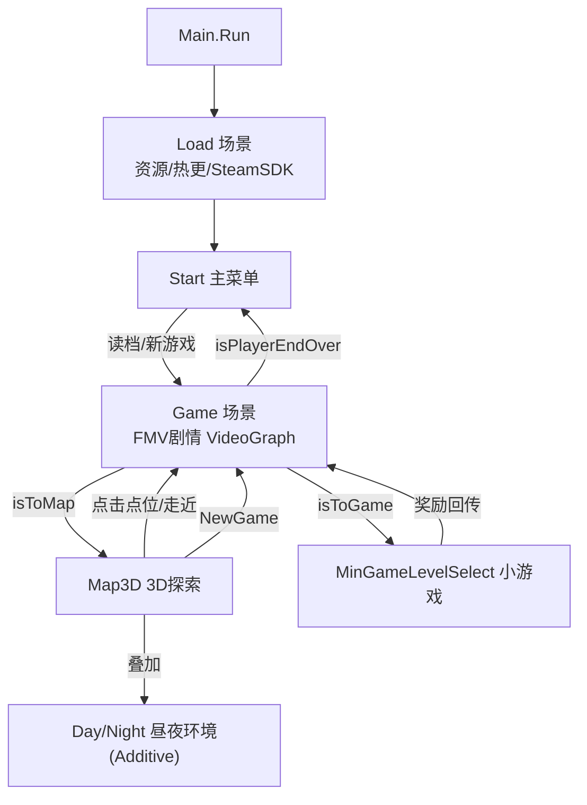

# 12 · 场景、地图与探索



## 12.1 场景体系

`Scenes` 枚举：`Start/Game/Map/Map3D/MinGameLevelSelect/Day/Night/Load`。

| 场景 | 职责 |
|---|---|
| `Load` | 启动页（初始化+预加载 UI/音频+SteamSDK）|
| `Start` | 主菜单 |
| `Game` | FMV 剧情节点流（核心，GameScene）|
| `Map3D` | 3D 探索 |
| `Day`/`Night` | 只为 Map3D 以 `LoadSceneMode.Additive` 叠加的昼夜环境场景 |
| `MinGameLevelSelect` | 小游戏关卡选择 |

**加载（LoadMrg）**：`Load(Scenes,mode,delay)` 用协程 + `allowSceneActivation` 做进度条异步加载，打开 `MapLoadWindows` 显示进度（0.5→0.9→完成）。对 `Map3D` 特判叠加 `Day/Night` 后 `ShowPoint+ShowActor+开 MainWindows`。

**昼夜**由 `GameDataMrg.IsMorning` 驱动，分三层：
1. 加性 `Day/Night` 场景；
2. Shader `_EMISSION` + PostProcessProfile + RenderSettings ambient/reflection；
3. 昼夜拆分 UI（`RiMap/YeMap`、`RiWindows/YeWindows`、`RiBgm/YeBgm`）。切换点在 `Map3DScene.SetYe()`。

## 12.2 3D 地图探索

`Map3DScene` 持有 `NavMeshAgent player`、`mapCamera`、`pointGroup`（点位父节点，子物体挂 `Map3DTriggerr`）。

- **点位**：每个点位用 `CollType` 枚举标识并绑定 `Xlsx_Event/VideoGraph`。`Map3DTriggerr.Trigger()` 校验轮次/昼夜/计数/条件后，设 `CurEventKey+CurVideoId` 并 `LoadMrg.Load(Scenes.Game)` 进入剧情。
- **玩家移动**：`MapPlayer` 驱动，`Move()` 用相机相对方向 + `agent.Move` 实时移动；`CheckTrigger()` 做距离判定（`checkDistance`）→ 确认框 → `Trigger()` 进剧情；首次靠近时 `UnLockPoint` 解锁点位；`CheckYf/CheckVehicleType` 换装与载具。
- **相机**：`CameraSync` 跟随；`mapCamera.WorldToViewportPoint` 把 3D 世界点映射成 2D UI 锚点（`MapWindows/MapItem`）。
- **2D 地图点击**可花钱/免费 Warp 传送（`MapWindows.UpdateMapIcon`）。

## 12.3 NPC（PolyPerfect）

`Common_WanderScript` 是协程式状态机，`DecideNextState()` 按优先级决策：
```
逃跑(dominance更高+awareness>0) > 追猎(dominance>0+scent+agression) > 漫游(wasIdle) > 待机
```
用 `IdleState/MovementState/AIState` 配置容器（`animationBool/stateWeight/min-max时间/moveSpeed/turnSpeed`），加权随机选 Idle 子状态，`NavMeshAgent`(或 `CharacterController` 兜底) 移动，`Animator` bool 播动画。`AIStats`(ScriptableObject) 提供 `dominance/stamina/power/toughness/agression/attackSpeed/territorial/stealthy`。`Common_WanderManager` 提供 `PeaceTime` 和平模式+全灭。`People_WanderScript` 继承它做人群。`RandomCharacterPlacer` 是编辑器散布工具。

## 12.4 360° 视频

`VideoNode.is360Video` 触发；`GameScene.PlayVideo` 里设 `videoState=Video360Scene`、隐藏剧情 UI、`Video360Scene.Instance.Init()`。
- `Init()` 恢复上次视向（`Video360Rotation` 字符串持久化）；按 `imgIsNor` 分普通图(`Img360BtnWindows`)或球体背景(`material.SetTexture("_MainTex",img360)`)；`drag.maxY/minY=videoNode.maxY/minY`；播昼夜 360 背景乐 `beiJin360Ri/beiJin360Ye`。
- `Drag` 组件：用 `delta.x/y*灵敏度` 旋转 yawParent(Y)/pitchChild(X)，pitch 用 `Mathf.Clamp(_, minY, maxY)` 上下钳制，`OnBeginDrag/EndDrag` 用 `isLockClick` 防误触。
- `VideoButton.ClickSure` 在 360 状态完成继续/切回剧情的跳转。
- 源码无 `Audio360` 标识符，360 背景音频即上述 `beiJin360Ri/Ye`。

## 12.5 值得学习的设计

1. **数据驱动 FMV 节点图**（`VideoNode/VideoGraph`，XNode）。
2. **`Xlsx_Event/Pos/Item_Query` + `CollType` 一键关联**。
3. **`WorldToViewportPoint` 世界↔UI 桥接**。
4. **昼夜多层分技术栈**（场景/Shader/PostProcess/UI/BGM 五层）。
5. **`LoadMrg` 两段式加载 + 加性场景管理 + 默认进度条**。
6. **NavMesh 四种用法**（SamplePosition/Warp/Move/SetDestination）。
7. **预加载 + 字典缓存复用的 VideoItem**。
8. **PolyPerfect 加权随机子状态 + 属性驱动生态 + PeaceTime**。
9. **360 视角可持久化**；拖动防误触。

## 12.6 关键代码片段索引
| 文件 | 行号 | 内容 |
|---|---|---|
| Map3DTriggerr.cs | 160-165 | 点位触发进剧情 |
| MapPlayer.cs | 90-114 / 198-211 | 玩家移动 / 换装载具 |
| MapWindows.cs | 146-150 | 2D 地图传送 |
| Map3DScene.cs | 49-65 / 190-199 | 点位结构 / ShowPoint |
| LoadMrg.cs | 58-72 | Map3D 叠加昼夜 |
| Drag.cs | 42-50 | 360 视角拖拽 |
| GameScene.cs | 279-286 | 360 视频切换 |
| Video360Scene.cs | 127-128 / 161-187 | 360 初始化/背景 |
| Common_WanderScript.cs | 342-406 / 412-421 / 475-493 | NPC 决策状态机 |

---

*下一章：学习指南与实战。*
