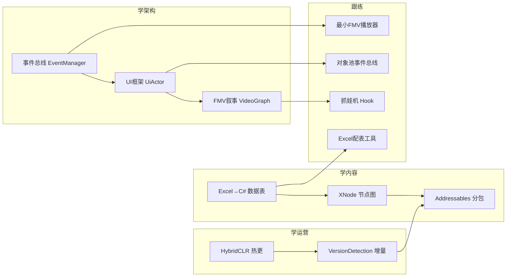

# 13 · 学习指南与实战

> 你是为了**学做游戏**（不是抄）。这一章把这套代码的"可复用经验"提炼成清单，并给一个能上手的跟练项目。



## 13.1 这套架构最值得学的 10 件事

1. **内容即图（XNode）**：把分支剧情做成可视化图，策划自助、程序零改。这是叙事游戏的生产力关键。
2. **事件总线 + 对象池消息**：`EventManager` 解耦模块，`List<object>` 消息体对象池复用（注意 GC 意识）。
3. **FMV 玩法钩子**：`evenTime` 时间轴事件 = 在视频上"打点"触发玩法，把玩法无缝缝进 CG。
4. **预加载无缝切换**：`loadRect1/2/3/4` 多播放器池 + `CopyRtToTex` 定格过渡 + `FadeVideo` 淡入，解决视频切换黑屏。
5. **热更三件套**：HybridCLR（代码）+ Addressables（资源）+ 本地服务器配置，上线后能持续运营。
6. **数据分层**：Excel 配数值 / XNode 配流程 / ScriptableObject 配全局，职责清晰。
7. **原生 + H5 双小游戏**：重交互用原生、轻玩法用 H5（CEF）。
8. **逻辑对象与 Unity 对象解耦**：`Actor`(纯 C#) + `ActorMono`(桥) —— 生命周期可控、可反射创建、可单测。
9. **属性分桶 + 统一字符串 key**：`property_<type>_<name>` 一个字典承载整套数值 + 回合/装备加成。
10. **表驱动 + 模板子物体批量生成 `TranFor`**：列表 UI 高度模板化，扩展成本极低。

## 13.2 要避开的坑（它自己踩过的）

1. **千万别忘删 `_BackUpThisFolder` / `_BurstDebugInformation`** —— 否则源码全暴露（本项目就是活教材）。
2. **加密 Key 不要硬编码在代码里**（本项目存档 Key 明文）。
3. **服务器地址不要用 localhost 占位发版**（本项目指向 127.0.0.1）。
4. **资源"改后缀"不是加密** —— 只能挡小白，魔数一识别就破。真要保护得做内容加密 + 自定义加载。
5. **超大文件拼接要写对头**（4.5GB 视频 ftyp size 错误的教训）。
6. **单一程序集偏大**（Assembly-CSharp 684KB/412 类），大项目建议拆分 Assembly Definition。

## 13.3 跟练项目（从这套代码出发）

### A. 最小 FMV 播放器（理解叙事引擎）
- 用 **XNode** 建一个 `StoryGraph` + `StoryNode`（`videoPath/subtitle/next`）。
- 用 **AVProVideo** 做 `VideoItem` 封装：预加载下一段、`CopyRtToTex` 定格、字幕 SRT。
- 在 `Update` 里按时间点触发事件（可先做"到点开一个按钮"）。
> 对应源码：`GameScene.cs` + `VideoItem.cs` + `VideoNode.cs`。

### B. 复刻 `EventManager` 对象池消息总线
```csharp
class EventManager {
  static ConcurrentDictionary<int, ConcurrentDictionary<int, Action<List<object>>>> _l;
  static ObjectPool<List<object>> _pool;
  static void Dispatch(int cat, int evt, List<object> data) {
      ... _l[cat][evt]?.Invoke(data); _pool.EnQueue(data);
  }
  static List<object> GetMsg() => _pool.DeQueue();
}
```
> 对应源码：`EventManager.cs`。

### C. 复刻抓娃机（黄金矿工）——最完整、可直接练手
用 `Script.MiNiGame/Hook.cs` + `MiNiGameMrg.cs` 的思路：
- 一个"抓手"：`Rotate`(左右摆) → 点击 `Shoot`(发射) → `Retract`(回收，速度=射速/重量)。
- 物品带 `scoreValue/weight/itemType`。
- 计分达标 → `GameOver(isSuc)` → 回传（我这里先返回主菜单即可）。
- 加属性加成：`ShuDu`(速度)、`ErWaiJianLi`(分数倍率)、`ZhaDan`(清屏)。
> 这是学习"状态机 + 2D 物理(Collider/OnTriggerEnter) + 数值回传"的最佳模板。

### D. 复刻一套数据驱动配表
写一个小工具：Excel/CSV(`|` 分隔) → 读成 `List<DataRow>`，反射 `SetValue` 填进强类型对象，存为 `TextAsset` 走 Addressables。就掌握了本游戏的 `Xlsx` 管线。

## 13.4 逆向/分析工具速查

| 目标 | 工具 |
|---|---|
| .dll → C# | ILSpy / ilspycmd / dnSpy |
| IL2CPP → dump.cs + 全部文本 | Il2CppDumper（`GameAssembly.dll` + `global-metadata.dat`）|
| bundle 贴图/资源 | UnityPy（读 `Texture2D/Sprite`；别 `read()` MonoBehaviour，会段错误）|
| 视频/音频魔数识别 | 自己读 16 字节，`ftyp`=MP4、`ID3`/`FFEx`=MP3 |

## 13.5 一句话收尾

**"视频是骨架，玩法是挂件，数值是胶水，数据是血脉。"** 这套代码最大的启示是：**用可视化节点图把"内容"和"代码"彻底解耦，再把所有玩法以事件形式挂到视频时间轴上**——这正是 FMV / 真人互动影视游戏能又快又好地产出的根本原因。你学会这套"内容驱动 + 事件驱动 + 数据驱动"的组织方式，比记住任何单个类都更有价值。

---

*合集结束。* 📚
