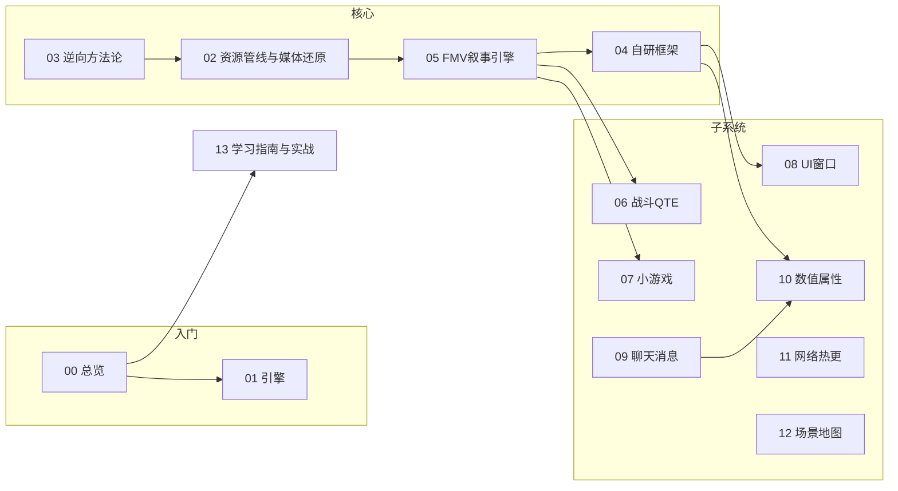

# 《重生2：我独自逆袭》逆向工程与架构解析 · 合集索引

> 本合集是把对一个 **Unity 2021.3.45f2c1 (IL2CPP) + HybridCLR 热更 + Addressables + AVProVideo + CEF 内嵌浏览器** 的 **FMV 互动叙事手游** 的完整逆向分析,组织成一套"书"。供学习游戏工程架构 / FMV 互动叙事 / 逆向方法论使用。**仅供学习研究,勿抄袭/商用/侵权。**

---

## 阅读顺序（推荐）

| 顺序 | 章节 | 内容 | 来源 |
|------|------|------|------|
| 1 | `00_总览与学习地图.md` | 这是什么游戏、技术底座总览、引擎/运行时/工程结构、整体设计评判 | 原创 |
| 2 | `01_引擎与运行时.md` | Unity 版本、IL2CPP/元数据、Burst、关键 DLL、配置 | 原创 |
| 3 | `02_资源管线与媒体还原.md` | Addressables、bundle、混淆算法(Base62-MD5)、视频/音频还原、图片解包、已知 bug | 原创 |
| 4 | `03_逆向方法论.md` | 如何从"泄漏开发版"拿到源码：路径、Il2CppDumper/dump.cs、命名还原、工具链 | 原创 |
| 5 | `04_自研框架FrameWork.md` | 启动/事件总线/UI框架/对象池/网络/下载/热更/配置 | 原创+补充 |
| 6 | `05_FMV互动叙事引擎.md` | VideoGraph/VideoNode/GameScene/VideoItem、分支/选择/QTE/条件节点、彩蛋 | 原创+补充 |
| 7 | `06_战斗与QTE系统.md` | 视频驱动功夫战斗、技能/血条/技能点/解锁、QTE 六类与成败分流、VideoItem 主循环 | subagent 5 |
| 8 | `07_小游戏矩阵.md` | 抓娃(黄金矿工)、视频反应面板、宝可梦、刮刮乐、商店、H5弹珠台、道具加成、奖励回流 | subagent 5 |
| 9 | `08_UI窗口系统.md` | UiManager/UiActor/Actor/ActorMono、特性注册、返回栈、媒体暂停恢复联动、全部界面 | subagent 1 |
| 10 | `09_剧情聊天与消息系统.md` | XNode ChatGraph/ChatNode、触发/推进/分支、短信/邮件、心跳/好感、存档 | subagent 2 |
| 11 | `10_管理器与数值属性.md` | 各 Mrg、PropertyData、属性分桶/回合/装备加成、存档持久化 | subagent 4 |
| 12 | `11_网络热更新与数据表.md` | Request/下载/版本检测/HybridCLR、Excel→C# Xlsx 表加载与查询 | subagent 4 |
| 13 | `12_场景地图与探索.md` | 场景体系/LoadMrg、3D地图/NavMesh/点位、NPC(PolyPerfect)、360°视频 | subagent 3 |
| 14 | `13_学习指南与实战.md` | 精华设计模式、可复用模板、要避的坑、跟练项目（QTE/抓娃最小工程） | 原创 |

## 阅读路线图

---

## 配套提取交付物（在本机）

| 位置 | 内容 |
|------|------|
| `重生2我独自逆袭Demo_代码提取\` | 反编译 C#(18程序集/1816 .cs)、IL2CPP C++(341文件)、managed_dlls、`il2cpp_dump\`(dump.cs+stringliteral.json) |
| `重生2我独自逆袭Demo_媒体资源\` | 还原后的视频(997 mp4)+音频(710 mp3)+对照表 |
| `重生2我独自逆袭Demo_资源解包\图片与UI\` | 从 531 个 bundle 解出的 **~8969 张图片/UI/贴图** |

---

*本合集由对真实构建产物的代码级反编译分析生成,非二手资料。*
